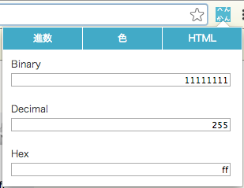
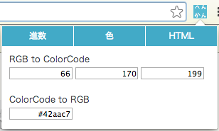
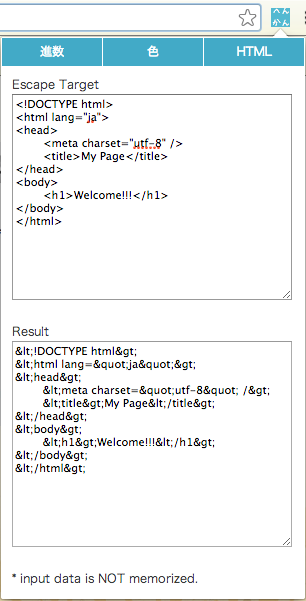

##*conversion guy* ver0.2.0

This is GoogleChrome Extention do conversion like below.

####binary <-> decimal <-> hex

Web app version is [HERE](http://takuti.me/dev/binary2decimal2hex/).

####color code <-> RGB 0-255 value

####HTML escape

This guy is using [AngularJS](http://angularjs.org/). If you wanna know detail, see: [GoogleChrome Extention Development using AngularJS - blog.takuti.me](http://blog.takuti.me/crx-dev-using-angularjs/) (Japanese).

To convert color code <-> RGB value, using [rgbcolor.js](http://www.phpied.com/rgb-color-parser-in-javascript/).
